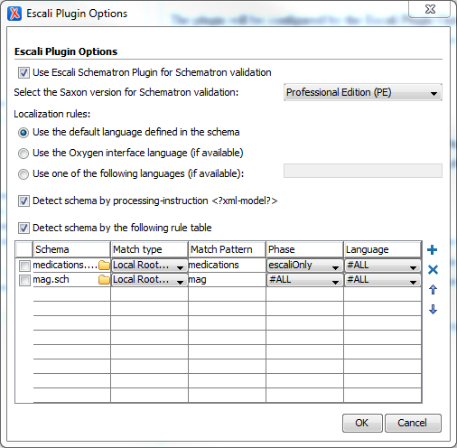

# Plugin Configuration

The plugin will be configured by the Escali Plugin Options menu. It can be reached by the *Options* button in the toolbar of the [Main View](views/Main.md).

The following preferences can be done:

## Switch the Plugin on/off

The first check box can be used to deactivate the plugin completely. If the check box is switched off, the Oxygen should act as if the plugin would be deinstalled.

## Saxon Editions

With the following drop down menu the user can use the Saxon edition which should be used for the internal XSLT transformations of the Escali Plugin. For instance, if a Schematorn schema uses schema-aware features the EE edition should be choosen.

The plugin uses always the build-in Saxon of the Oxygen, so it depends on the Oxygen version, which Saxon version is used.

## Localization rules

The Escali supports the localization concept of the ISO Schematron standard, which was mentioned in the appendix. [Read more](http://www.schematron-quickfix.com/escali/escali-ext_en.html#sqf:d121e779)

The localization rules configure the Escali, how to act if a Schematron schema has multiple languages inside.

- *Use the default language defined in the schema*
  
  If this option is active, the root element sch:schema should have an xml:lang attribute. This will be used as default language.
  
- *Use the Oxygen interface language (if available)*

  If this opiton is active, the language will be prefered, which is defined as Oxygen interface language. This can be configured in the Oxygen preferences.
  If the Oxygen interface language was not used in the schema, the default schema will be used. 
  
- *Use one of the follwoing languages (if available):*

  If this option is active, the following field should contain one or more language codes. Multiple codes should be separated by whitespaces. The Escali will choose the first language of this list, which is available in the Schematron schema.
  
## Detect the schema

The Oxygen API includes a basic problem for external validation engines. Though it is possible to intervene the validation process, there is no information about the schema which was associated by the Oxygen (by validation scenario, xml-model PI, manual validations, etc.). That's why the Escali Plugin needs it's own association rules.

### Model PI

One exception is the xml-model PI. This will be used to associate the XML document with a (Schematron) schema. As the PI will be presence in the prolog of the XML document, the Escali Plugin is able to detect the Schematron schema by such a PI.

To enable this xml-model PI detection, choose the check box *Detect schema by processing-instruction <?xml-model?>*

### Rule table

For static, XML instance independent schema associations the Escali Oxygen Plugin provides an own rule table, which is similar to the [association rules of an Oxygen framework](https://www.oxygenxml.com/doc/versions/19.1/ug-editor/topics/dg-author-settings.html).

To enable this table rules activate the check box *Detect schema by the following rule table*.

#### Rules

Each rule defines for one Schematron schema which documents should be validated. Therefor it can use different match types and a match pattern:

- File name
  
  E.g. the match pattern `*.xml` would match to all files with the extension ".xml"
  
- Namespace
  
  The namespace given namespace in the match pattern refers to the namespace of the root element of a document.
  
- Local Root Name
  
  The match pattern refers to the local name of the root element of a document
  
- Attribute
  
  A match pattern `attr="value"` would match to all documents, which have a root element witch an attribute `attr` with the value `value`
  
- Framework
  
  If the match type Framework is choosen the match pattern field turns to a dropdown list of all available frameworks.
  
Additional to this association rules a rule can define the phase and the language for this Schematron validations.
