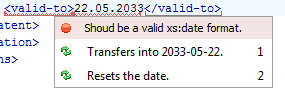

# QuickFix Context Menu

The QuickFix Context Menu is an alternative way to execute a QuickFix. If the current XML document is validated by the Escali Plugin ([read here how to configure it](Configuration.md)) the Schematron errors will be highlighted in the text and the Author view of the document. Inside of the document you can open the QuickFix context menu: 

- Move the cursor to the highlighted text and press ALT + 1
- Press CTRL and make a right-click on the highligted text

The QuickFix Context menu should pop up, containing all QuickFixes for the error of the highlighted text.

If you click on a QuickFix, it is executed instantly. If the executed has UserEntries a UserEntry dialog will be popuped, which is similar to the [Escali UserEntries view](views/UserEntries.md). 
