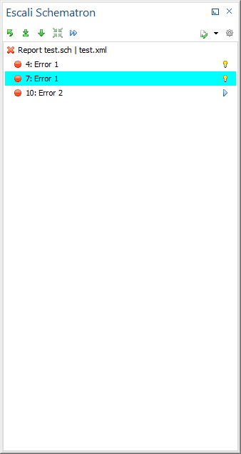

# Escali Schematron View

The Escali Schematron View (short main view) shows the Schematron error messages of the current active document in the Oxygen.

Also there is a toolbar with global actions:

- Deselect all selected QuickFixes
- Select similar QuickFixes as those which was already selected (two buttons with different depths)
- Select all default QuickFixes
- Execute all selected QuickFixes
- Refresh the Oxygen validation
- Escali Plugin Options

## Error List

The error list shows all Schematron errors. The icon indicates the error level (info, warning, error, critical error). The leading number refers to the line number. At the line end a yellow bulb indicates that there is at least one QuickFix available for this error.

If you select one Schematron error with such a bulb the [Escali QuickFixes view](QuickFixes.md) will show all available QuickFixes for this Schematron error.

The yellow bulb turns to a blue triangle if one of those QuickFixes was selected. Click on the triangle and the selected QuickFix will be executed.

## Why don't I see any Schematron errors?

Please make sure that you configured the [Plugin correctly](../Configuration.md). The main view shows only error messages which was detected by the Escali Plugin for Schematron validation.