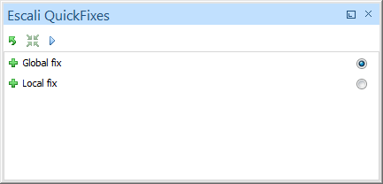
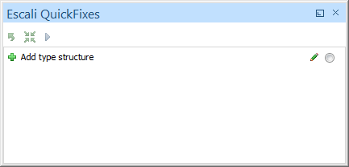

# Escali QuickFixes View

The Escali QuickFix View shows for the selected Schematron error in the [main view](Main.md) all available QuickFixes.

Additionally there is a toolbar with the following actions:

- Unselect the selected QuickFix
- Select the default QuickFix of this Schematron error
- Execute the selected QuickFix

## QuickFix List

The icon of each QuickFix shows the kind of action (add, delete, replace). The descritption is the title of a QuickFix.

With the radio button at the line end you can select the QuickFix.

## QuickFixes with UserEntries

A red pen next to the radio box indicates that the QuickFix has at least one UserEntry.

If you click on a QuickFix with a UserEntry the [Escali UserEntries View](UserEntries.md) shows all UserEntries of this QuickFix.

