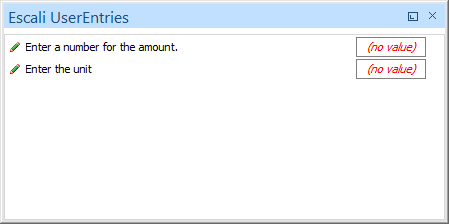
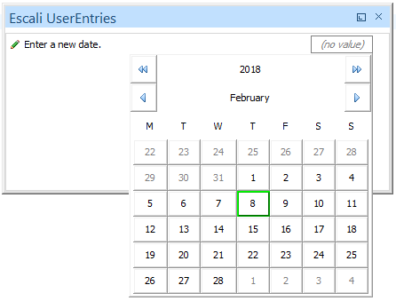

# Escali UserEntries View

The Escali UserEntries View shows for the selected QuickFix in the [QuickFix view](QuickFixes.md) all available UserEntries.

Each UserEntry has a description and a entry field. To enter a value click on the entry field. Dependening on the type of the UserEntry a different entry mask pops up (text field, calendar, drop down list).

